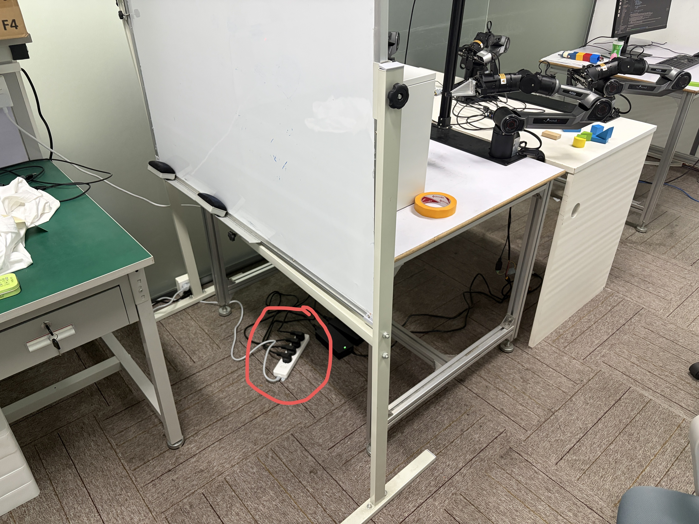
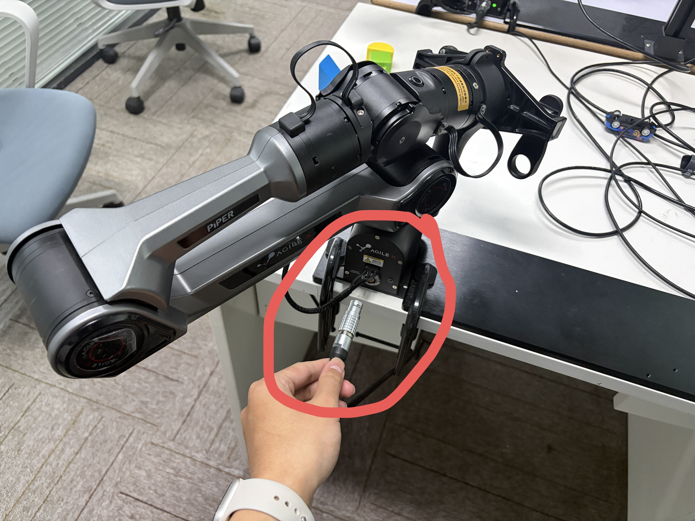
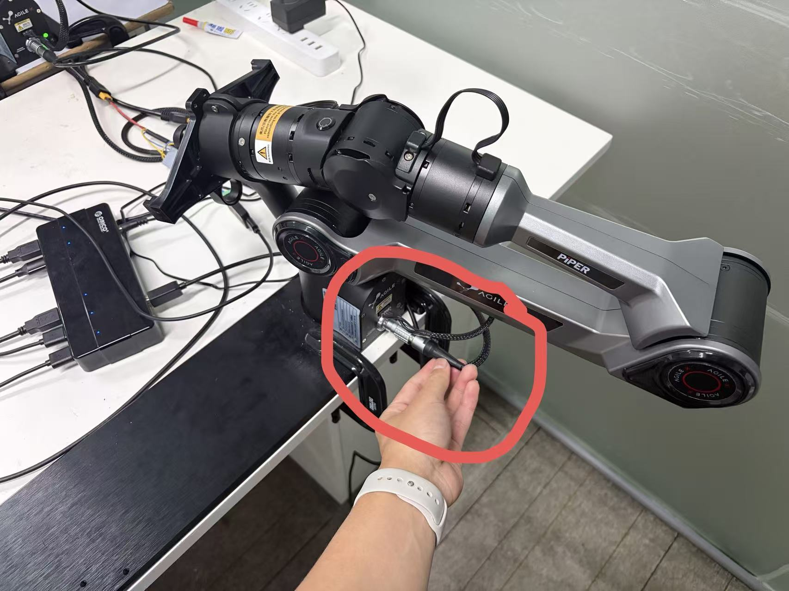
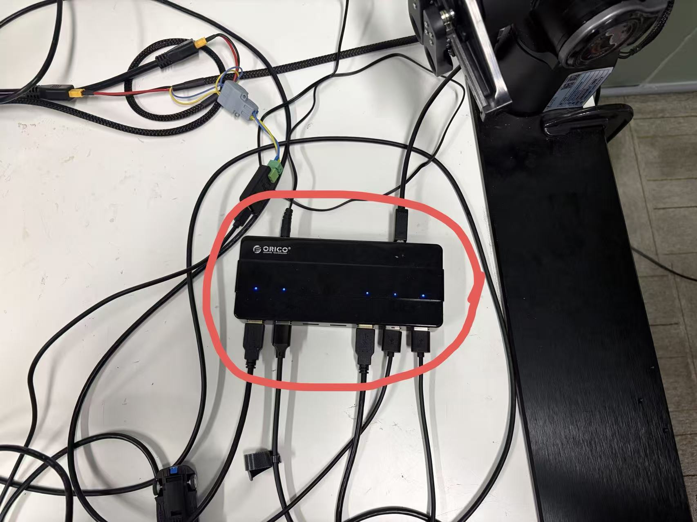
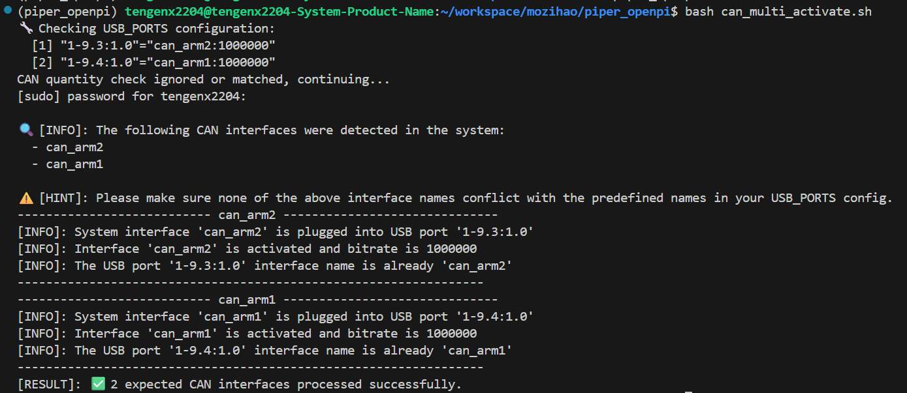

# piper_openpi使用文档

## 项目概览

本项目旨在利用piper机械臂采集示教数据、使用pi0.5进行微调，并最终在piper机械臂上进行测试。

## Quick Start

如果需要向客户展示机械臂遥操与推理，请阅读下面的教程

### 遥操

首先确保机械臂是通电的：



随后，将示教输入臂（主臂）的电源接上。注意！接通电源前主臂的姿态最好与从臂相近，否则接通的一瞬间从臂移动到主臂的姿态可能会造成损坏。




接通电源后，即可开始演示遥操作。

### 推理

该教程暂时限定于演示put item in drawer任务。

首先确保机械臂处于通电状态，并且示教输入臂（主臂）的电源已被切断。并检查摄像头和机械臂是否正确通过 hub 与电脑成功连接，都连接上会有5个蓝灯（如图）。



然后运行：

```bash
bash can_multi_activate.sh
```

若观察到如下输出，则机械臂激活成功



接着打开 infer_piper_dual.py 文件，定位到约第80行：

```python
# piper_right.JointCtrl(41913, 50004, -74840, -3245, 47584, -2760)
# piper_left.JointCtrl(-36499, 299, -3872, -54116, 5961, 54201) # open drawer 
# piper_right.JointCtrl(41920, 49997, -74840, -3245, 47584, -2760)
# piper_left.JointCtrl(-24171, 14878, -4253, -27609, -8485, 17650) # open & close drawer
piper_right.JointCtrl(40036, 3630, -9526, -3140, 17670, -12043)
piper_left.JointCtrl(-40543, 177, -104, -87029, -5647, 77959) #  put item in drawer
# piper_right.JointCtrl(29886, 49993, -42882, -3246, 54486, 9274)
# piper_left.JointCtrl(-20531,     0, -169, 1265, 23982, 10709) #  pick_block
```

这里做的是机械臂位置的初始化，请确保未被注释掉的部分是 put item in drawer 任务对应的机械臂初始位置

```python
obs = {
    'observation/left_image': all_device_images[0],
    'observation/top_image': all_device_images[1],
    'observation/right_image': all_device_images[2],
    'observation/state': current_observation_state,
    # 'prompt': "open drawer then close the top drawer",
    'prompt': "put the yellow block into the second drawer",
    # 'prompt': "pick up the yellow block",
    # 'prompt': "hello world"
}
```

根据需要修改prompt。如果需要夹取不同颜色（红色、蓝色...）的物体，则将yellow改为red, blue...如果需要开其他层（最上层，第三层）的抽屉，则将second改为top, third。为了演示的稳定性，推荐只使用 yellow red ，其它颜色均为OOD的泛化情况，可能出现不稳定情况。

然后通过如下指令开始推理：

```bash
python infer_piper_dual.py --checkpoint_dir /home/tengenx2204/workspace/mozihao/piper_openpi/openpi/checkpoints/pi05_open_drawer_full/29999 \
                            --config_name pi05_put_item_in_drawer \
                            --mode joint
```

机械臂会在脚本运行后的5s左右完成初始化，若运行脚本后机械臂未移动到初始位置，请 kill 掉并重新运行推理指令。

模型初始化需要大约30s，请耐心等待。执行过程中有少许抖动为正常状态。

如果任务已完成，或者机械臂发生了意外的碰撞，请立即在命令行通过 Ctrl+C 将进程kill掉。


## 项目结构
```
piper_openpi/
├── openpi/                     # openpi源代码
├── can_multi_activate.sh       # 机械臂激活脚本
├── piper_test.py               # 机械臂测试脚本
├── multi-cam.py                # 相机测试脚本
├── piper_data_collect.py       # 数据采集脚本
├── align.py                    # 机械臂数据与图像数据对齐脚本
├── convert.py                  # 将对齐后的数据转换为Lerobot格式，以便openpi训练
├── piper_dual_replay.py        # 数据集复播脚本
├── infer_piper_dual_replay.py  # 模型在训练集上推理脚本
├── infer_piper_dual.py         # 模型在真机上实时推理脚本
├── utils.py                    # 包含模型加载、模型推理、机械臂执行等工具函数
└── temp.txt                    # 记录常用指令
```

## 详细功能与使用示例

### can_multi_activate.sh

在运行piper_data_collect.py前，必须先执行此脚本以激活机械臂（可能需要sudo权限）
```bash
bash can_multi_activate.sh
```

### piper_test.py

若希望确认机械臂是否成功连接并激活，可运行
```bash
python piper_test.py
```
并观察机械臂是否如预期移动。

### multi-cam.py

若希望确认相机是否成功连接，可运行
```bash
python multi-cam.py
```

该脚本通过realsense接口获取相机传感器的数据，并通过opencv将多个图像拼接并显示在屏幕上。

### piper_data_collect.py

机械臂和相机数据采集脚本，使用multiprocessing库实现了2个线程异步采集机械臂数据和相机数据。使用样例：

```bash
python piper_data_collect.py --task_name pick_block --start_episode 0 --fps 30
```

- task_name: 采集的数据将会存放在/home/tengenx2204/workspace/mozihao/<task_name>下
- start_episode: 可通过<start_episode>从断点恢复采集
- fps: 指定了相机的采集频率

机械臂数据和相机数据分别保存为两份.h5文件

### align.py

机械臂和相机数据对齐脚本。

- 通过数据中记录的timestamps，二分查询距离当前图像帧最近的机械臂数据并保留
- 将图像降采样至openpi需要的224x224，保存为JPEG格式，存储在当前episode的/frames文件夹下
- 将下一帧的state记录为当前帧的action
- 112行（可选）降采样50%数据

```bash
python align.py --data_dir /home/tengenx2204/workspace/mozihao/Data/pick_block --start_episode 0
```

- data_dir: 指定数据集路径
- start_episode: 从<start_episode>开始转换

## convert.py

将align后的数据集转换为Lerobot格式。

```bash
python convert.py
```

请在convert_dataset()函数的开头修改<original_data_dir>为你希望转换的数据集路径，并将<repo_id>修改为你希望转换后存储数据集的文件夹名。

